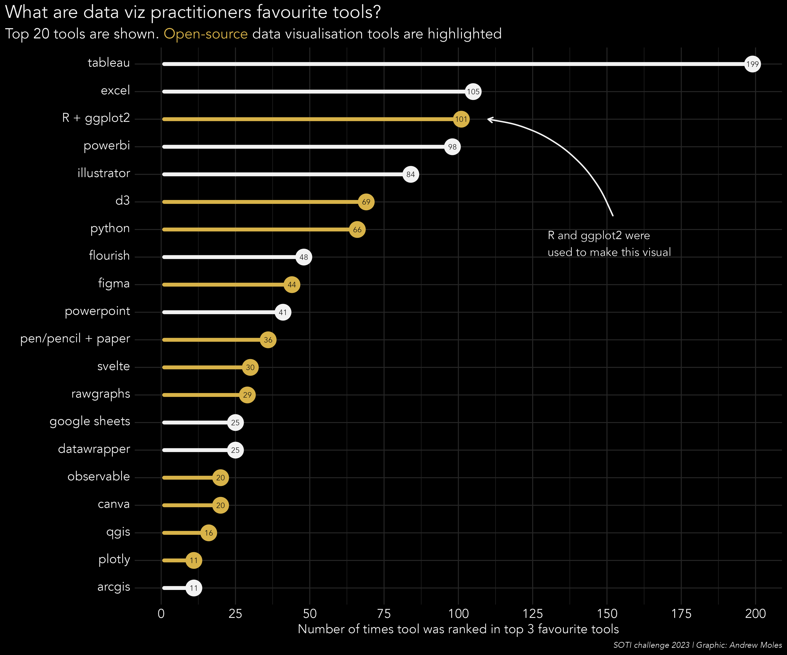
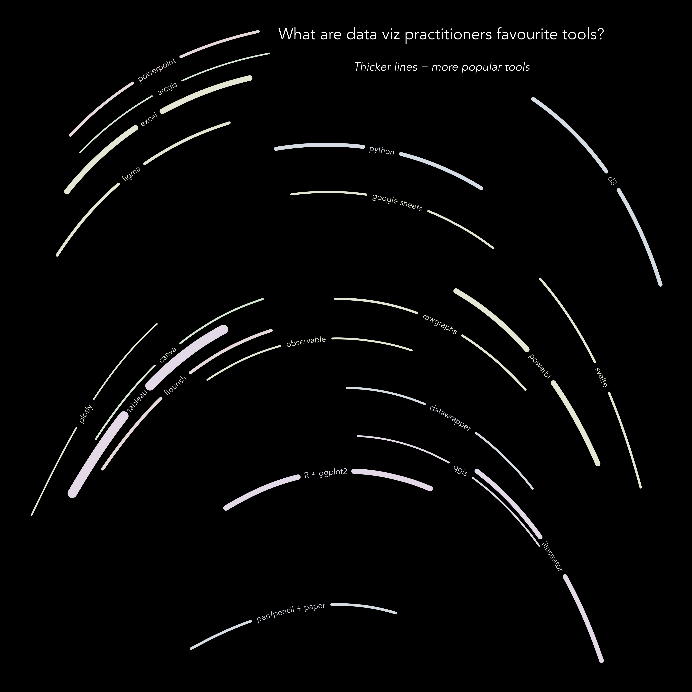
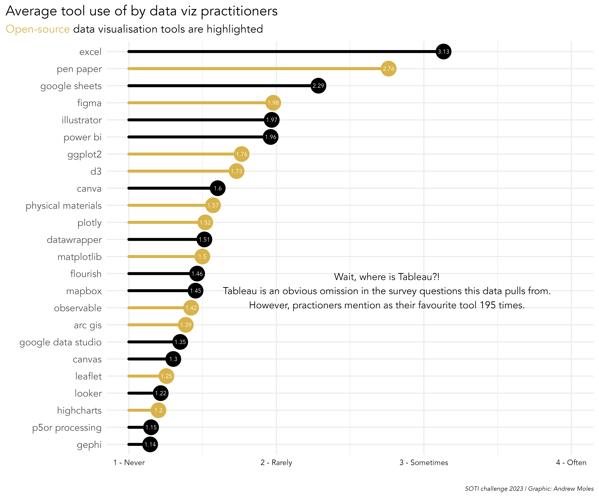

# Data Visualisation Society (DVS) visualisation challenge

Each year the DVS runs a [visualisation challenge](https://www.datavisualizationsociety.org/soti-challenge) based on data they collected about what is currently happening in the industry; or at least those that use data visualisation for their work. 

## 2023

For the [2023 challenge](https://www.datavisualizationsociety.org/soti-challenge-2023) I made an explanatory visual in two ways, functional and arty. 

I also made some other visuals which I don't think are quite as interesting or useful. 

  
  

<!--
 
-->
